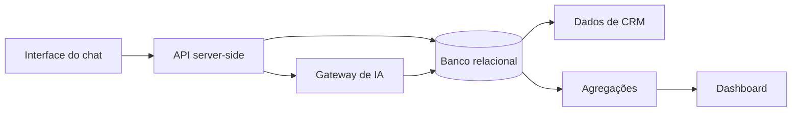

# Guia de Integração: Chatbot, IA, CRM e Dashboard

> Um guia curto sobre como diferentes tecnologias podem trabalhar juntas em um
> ecossistema com atendimento conversacional, inteligência artificial, dados de
> CRM e visualização analítica.

[Ler online](https://eduardoswarowsky.github.io/guia-ia-conversacional-crm/)
· [Visão geral](docs/01-visao-geral.md)
· [Checklist](docs/07-checklist-de-integracao.md)
· [Exemplos](docs/exemplos-de-integracao.md)

---

## Escopo

Este repositório é uma referência curta de integração técnica. A proposta é explicar como tecnologias diferentes podem trabalhar juntas em sistemas
conversacionais:

- interface web e rotas de API;
- provedores de IA;
- banco relacional;
- dados de CRM;
- dashboard de analytics;
- regras de segurança e privacidade.

O foco está nas fronteiras entre as camadas: quais dados passam, onde cada
tecnologia entra e quais cuidados evitam acoplamento, vazamento de credenciais
ou métricas inconsistentes.

## Mapa rápido

## O que este guia cobre

| Capítulo | Tema | Pergunta respondida |
|---|---|---|
| [1. Visão geral](docs/01-visao-geral.md) | integração entre camadas | como as partes se encaixam? |
| [2. Mapa das tecnologias](docs/02-mapa-das-tecnologias.md) | papel de cada tecnologia | onde Next.js, TypeScript, SQL e IA entram? |
| [3. Chatbot e IA](docs/03-chatbot-e-ia.md) | fluxo conversacional | como conectar mensagem, contexto e modelo? |
| [4. Dados e CRM](docs/04-dados-e-crm.md) | persistência e sinais | como transformar eventos em histórico útil? |
| [5. Dashboard](docs/05-dashboard-e-analytics.md) | métricas e visualização | como exibir dados sem expor registros brutos? |
| [6. Segurança](docs/06-seguranca-e-operacao.md) | operação e proteção | onde ficam chaves, limites e autorização? |
| [7. Checklist](docs/07-checklist-de-integracao.md) | revisão final | o que validar antes de publicar? |
| [Exemplos](docs/exemplos-de-integracao.md) | snippets genéricos | como representar as fronteiras em código? |

## Como ler

Leia como um material de arquitetura aplicada. Os trechos de código são pequenos
e servem para mostrar contratos entre tecnologias, não para entregar uma
implementação pronta. A página de [exemplos](docs/exemplos-de-integracao.md)
organiza os snippets por fronteira de integração.

## Limites

Este guia não inclui:

- código-fonte completo de aplicação;
- prompts finais;
- regras comerciais específicas;
- design de produto;
- fórmulas de score proprietárias;
- dados reais;
- endpoints completos prontos para uso direto.

Use o material para entender a integração técnica. A solução final, domínio,
interface, regras e dados devem ser próprios de cada projeto.
