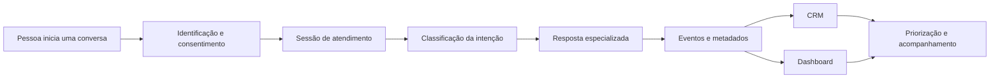

# Guia de IA Conversacional, CRM e Analytics

> Um roteiro prático para projetar experiências conversacionais que também
> geram dados úteis para relacionamento, atendimento e tomada de decisão.

[Ler o guia online](https://eduardoswarowsky.github.io/guia-ia-conversacional-crm/)
· [Começar pelos fundamentos](docs/01-fundamentos.md)
· [Seguir o roteiro de implementação](docs/08-roteiro-de-implementacao.md)

---

## Para quem é este guia

Este material é para quem quer combinar três áreas em uma única aplicação:

- **IA conversacional**, para entender a intenção e responder com contexto;
- **CRM**, para transformar interações em histórico e sinais de relacionamento;
- **analytics**, para converter eventos em métricas e decisões.

Você não encontrará uma aplicação pronta para copiar. O objetivo é explicar as
decisões, as integrações e a ordem de implementação para que você construa uma
solução adequada ao seu próprio domínio.

## O que você vai construir

Ao final da trilha, você terá uma referência para projetar um sistema com este
fluxo:

O valor não está apenas na resposta da IA. Ele aparece quando cada conversa
também melhora a experiência futura, organiza o atendimento e produz
informações que podem ser verificadas.

## Trilha recomendada

| Etapa | Capítulo | Resultado |
|---|---|---|
| 1 | [Fundamentos](docs/01-fundamentos.md) | Definir problema, limites e critérios de sucesso |
| 2 | [Arquitetura](docs/02-arquitetura.md) | Separar interface, domínio, IA e persistência |
| 3 | [Dados e CRM](docs/03-dados-e-crm.md) | Modelar contatos, sessões, mensagens e sinais |
| 4 | [IA conversacional](docs/04-ia-conversacional.md) | Organizar triagem, especialistas e provedores |
| 5 | [Experiência do chat](docs/05-experiencia-do-chat.md) | Desenhar uma jornada clara, responsiva e resiliente |
| 6 | [Dashboard](docs/06-dashboard-e-analytics.md) | Traduzir perguntas de negócio em métricas |
| 7 | [Segurança](docs/07-seguranca-e-privacidade.md) | Proteger credenciais, rotas e dados pessoais |
| 8 | [Roteiro](docs/08-roteiro-de-implementacao.md) | Implementar por fases com critérios de saída |
| 9 | [Validação](docs/09-checklist-de-validacao.md) | Testar comportamento, dados, IA e operação |
| 10 | [Referência de código](docs/10-referencia-de-codigo.md) | Conectar os fragmentos em um fluxo completo |

## Tecnologias abordadas

As tecnologias são apresentadas pelo papel que exercem, não como uma receita
obrigatória.

| Responsabilidade | Referência usada | Por que faz sentido |
|---|---|---|
| Aplicação web e APIs | Next.js com App Router | Mantém interface e backend no mesmo projeto |
| Contratos e domínio | TypeScript | Reduz divergências entre tela, API e dados |
| Interface | Tailwind CSS e componentes acessíveis | Acelera consistência visual e responsividade |
| Persistência | SQLite com Drizzle ORM | Oferece um início simples, tipado e local |
| Modelos de linguagem | Gemini ou OpenAI | Permite comparar custo, qualidade e disponibilidade |
| Visualização | Recharts | Conecta agregações do backend a gráficos responsivos |
| Continuidade no navegador | `localStorage` | Mantém apenas o contexto necessário para a experiência |

Em produção, cada peça pode ser substituída. A arquitetura continua válida com
outro framework web, banco relacional, provedor de IA ou biblioteca de gráficos.

## Exemplos de código

Algumas decisões ficam mais claras quando aparecem em código. Por isso, os
capítulos incluem trechos selecionados para:

- gateway independente de provedor;
- triagem com saída estruturada e fallback;
- orquestração de uma mensagem;
- schema relacional mínimo;
- score com detalhamento dos fatores;
- cliente web com cache local limitado;
- consultas agregadas para analytics;
- validação, autorização e rate limiting.

Os capítulos mostram trechos curtos no contexto da decisão. As versões de
referência ficam em [`examples/`](examples/README.md), e a
[integração completa](docs/10-referencia-de-codigo.md) explica como os módulos se
conectam.

## Princípios do projeto

1. **O servidor controla a IA.** Credenciais, prompts, políticas e logs não
   pertencem ao navegador.
2. **O banco é a fonte da verdade.** O armazenamento local melhora a experiência,
   mas não substitui a persistência oficial.
3. **A conversa gera eventos.** Intenção, categoria, confiança e resultado devem
   ser registrados como dados consultáveis.
4. **Métricas começam com perguntas.** Um dashboard útil responde decisões reais,
   em vez de apenas exibir números disponíveis.
5. **A IA precisa de saída controlada.** Classificações devem usar contratos
   estruturados, validação e caminhos de fallback.
6. **Privacidade faz parte do fluxo.** Coleta mínima, consentimento e retenção
   devem ser definidos antes do lançamento.

## Limites deste guia

Para manter o conteúdo seguro e reutilizável, este repositório não publica:

- código-fonte da aplicação que originou o estudo;
- prompts completos ou regras comerciais específicas;
- fórmulas exatas de pontuação;
- credenciais, bancos, conversas ou dados reais;
- identidade visual, catálogo ou conteúdo de produto;
- componentes completos, prompts finais ou endpoints da aplicação original;
- detalhes operacionais exclusivos de uma implementação.

Os exemplos cobrem somente as partes necessárias para explicar cada integração.
Entidades, políticas, regras comerciais e adaptadores devem ser definidos de
acordo com o projeto em que forem usados.

## Como usar

Se você está começando, leia os capítulos na ordem e preencha as decisões
propostas em cada um. Se já possui uma aplicação, use o
[checklist de validação](docs/09-checklist-de-validacao.md) para localizar
lacunas antes de alterar a arquitetura.

Para consultar termos específicos, veja o [glossário](docs/glossario.md).

---

Este repositório é uma referência educacional de arquitetura. Adapte os padrões
ao risco, ao volume de dados e às obrigações legais do seu contexto.
