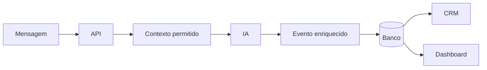

# 1. Visão Geral

[Início](../README.md) · [Próximo: Mapa das tecnologias](02-mapa-das-tecnologias.md)

Este guia olha para um ecossistema conversacional pelo ponto de vista da
integração. A pergunta central é:

> como conectar interface, IA, banco, CRM e dashboard sem misturar
> responsabilidades?

## A ideia em uma frase

Um chat coleta uma mensagem, o backend aplica regras e contexto, a IA responde
ou classifica, o banco registra eventos e o dashboard consome dados agregados.



## Fronteiras principais

| Fronteira | O que passa | O que não deve passar |
|---|---|---|
| Chat → API | mensagem, sessão, dados consentidos | chave de IA, regra interna |
| API → IA | instrução, contexto mínimo, formato esperado | banco inteiro, dados sem necessidade |
| API → Banco | eventos, mensagens, metadados | segredo de provedor em texto aberto |
| Banco → Dashboard | agregações e filtros | registros pessoais sem autorização |

## O papel da IA

A IA aparece como uma capacidade dentro do ecossistema, não como dona da
arquitetura. Ela pode classificar intenção, gerar resposta, resumir sessões e
apoiar insights. O backend continua responsável por autorização, persistência,
limites, logs e regras de negócio.

## Pequeno contrato mental

```ts
type IntegrationEvent = {
  sessionId: string;
  role: "user" | "assistant";
  content: string;
  intent?: string;
  confidence?: number;
  createdAt: string;
};
```

Esse contrato resume a ideia: cada interação gera um evento que pode alimentar
o histórico, o CRM e as métricas. Os campos variam por projeto.

Exemplo relacionado: [contrato entre camadas](exemplos-de-integracao.md#contrato-entre-camadas).

## O que evitar

- frontend chamando provedor de IA diretamente;
- dashboard calculando regras de CRM no navegador;
- prompts espalhados por várias rotas;
- métricas sem definição única;
- armazenamento local tratado como banco;
- IA decidindo permissões ou ações irreversíveis.

[Próximo: Mapa das tecnologias](02-mapa-das-tecnologias.md)
