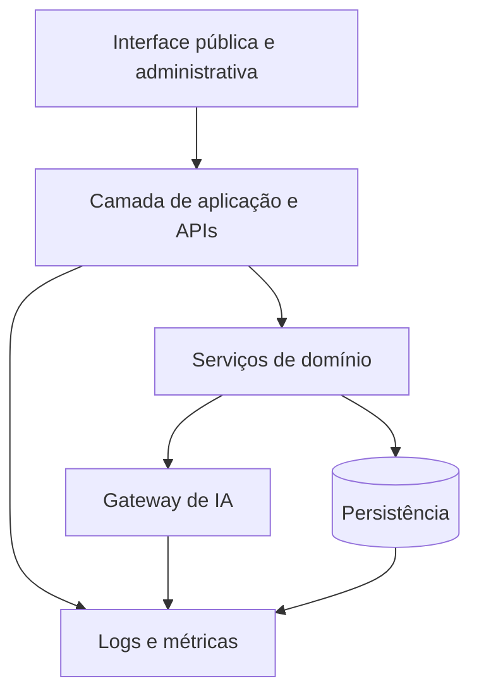
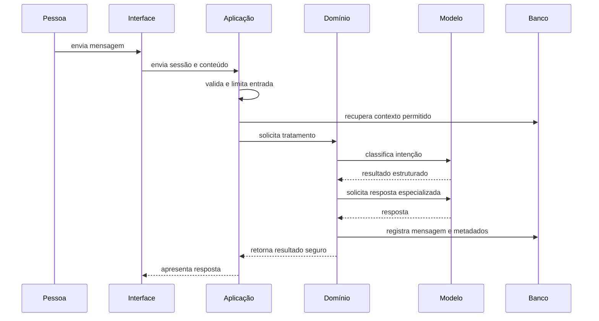

# 2. Arquitetura

[Anterior: Fundamentos](01-fundamentos.md) · [Início](../README.md) ·
[Próximo: Dados e CRM](03-dados-e-crm.md)

A arquitetura deve permitir que interface, regras de negócio, provedores de IA
e banco evoluam de forma independente.

## Divida por responsabilidade



| Camada | Responsabilidade | Não deve fazer |
|---|---|---|
| Interface | Coletar entrada e apresentar estados | acessar banco ou provedor diretamente |
| Aplicação | Validar requisições e coordenar casos de uso | concentrar regras comerciais complexas |
| Domínio | Aplicar políticas de conversa e CRM | depender de componentes visuais |
| Gateway de IA | Normalizar provedores e respostas | decidir regras de negócio |
| Persistência | Guardar estado e eventos | formatar dados para gráficos |
| Observabilidade | Registrar saúde, custo e falhas | armazenar conteúdo sensível sem necessidade |

## Fluxo de uma mensagem



Essa sequência é um contrato, não uma exigência de duas chamadas ao modelo.
Dependendo de custo e latência, a classificação pode ser feita por regras, por
um modelo menor ou junto da geração final.

## Use uma fronteira para provedores

O domínio deve pedir uma capacidade, como “classificar” ou “responder”, sem
conhecer detalhes do SDK. A fronteira comum recebe:

- instrução do sistema;
- mensagem atual;
- histórico permitido;
- parâmetros de geração;
- formato esperado.

Ela devolve:

- conteúdo normalizado;
- identificação do provedor e modelo;
- duração e consumo, quando disponíveis;
- erro em um formato conhecido.

Com isso, trocar Gemini por OpenAI, criar fallback ou comparar modelos não exige
reescrever o fluxo de negócio.

### Isolando o provedor

```ts
interface AIProvider {
  generate(request: AIRequest): Promise<AIResult>;
}

class AIGateway {
  constructor(
    private providers: Record<string, AIProvider>,
    private defaultProvider: string,
  ) {}

  generate(request: AIRequest, name = this.defaultProvider) {
    const provider = this.providers[name];
    if (!provider) throw new Error("Provider not configured");
    return provider.generate(request);
  }
}
```

O SDK específico fica dentro da implementação de `AIProvider`. O restante da
aplicação depende apenas do contrato. Veja o
[gateway completo](https://github.com/EduardoSwarowsky/guia-ia-conversacional-crm/blob/master/examples/ai/gateway.ts).

## Mantenha contratos internos

Defina contratos para os principais casos de uso:

| Caso de uso | Entrada mínima | Saída mínima |
|---|---|---|
| identificar contato | campos consentidos | identificador estável |
| iniciar sessão | contato e contexto do canal | identificador da sessão |
| tratar mensagem | sessão e conteúdo | resposta e metadados |
| encerrar sessão | sessão e resultado | status final |
| gerar resumo | sessão autorizada | resumo rastreável |
| consultar métricas | período e filtros | agregações, nunca registros desnecessários |

Os nomes e formatos são seus. O importante é impedir que cada tela invente uma
versão diferente da mesma operação.

### Mantendo a rota curta

```ts
export async function POST(request: NextRequest) {
  const input = chatInputSchema.parse(await request.json());
  const result = await processMessage(chatDependencies, input);

  return NextResponse.json({
    reply: result.reply,
    intent: result.triage.intent,
  });
}
```

A rota converte HTTP em uma chamada de aplicação. Persistência, triagem e
geração ficam no orquestrador. Veja a
[rota de referência](https://github.com/EduardoSwarowsky/guia-ia-conversacional-crm/blob/master/examples/api/chat-route.ts)
e o
[processamento da mensagem](https://github.com/EduardoSwarowsky/guia-ia-conversacional-crm/blob/master/examples/chat/process-message.ts).

## Pense na evolução do banco

SQLite funciona bem para protótipos, demonstrações e ambientes de baixa
concorrência. Planeje migração quando surgirem:

- múltiplas instâncias de servidor escrevendo ao mesmo tempo;
- necessidade de alta disponibilidade;
- grande volume de eventos;
- relatórios pesados;
- equipes ou organizações isoladas;
- requisitos avançados de auditoria.

A mudança para PostgreSQL ou outro banco é mais simples quando o domínio não
depende de recursos exclusivos do banco inicial.

## Antes de seguir

Avance quando cada responsabilidade tiver um único lugar claro e nenhuma chave
de IA, consulta de banco ou regra de negócio depender de um componente visual.

[Próximo: Dados e CRM](03-dados-e-crm.md)
