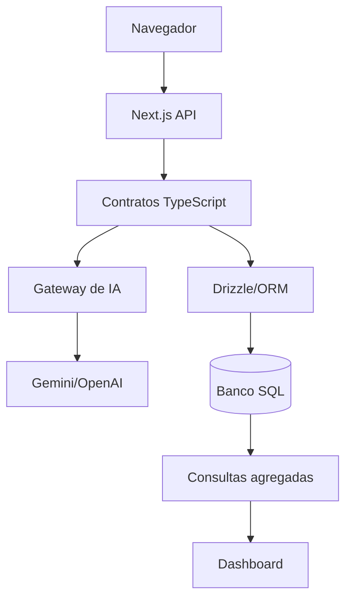

# 2. Mapa das Tecnologias

[Anterior: Visão geral](#/docs/01-visao-geral) · [Início](#/) ·
[Próximo: Chatbot e IA](#/docs/03-chatbot-e-ia)

As tecnologias abaixo são exemplos de papéis arquiteturais. Elas podem ser
trocadas, desde que a fronteira entre as camadas continue clara.

| Tecnologia | Papel na integração | Observação |
|---|---|---|
| Next.js | interface, páginas e rotas server-side | evita expor segredos no cliente |
| TypeScript | contratos entre UI, API e domínio | reduz divergência de formatos |
| SQLite/PostgreSQL | persistência de sessões, mensagens e eventos | escolha depende de volume e operação |
| Drizzle/ORM | schema tipado e consultas | mantém o modelo de dados explícito |
| Gemini/OpenAI | classificação, resposta e resumo | deve ficar atrás de um gateway |
| Recharts/visualização | gráficos no dashboard | consome dados agregados |
| localStorage | continuidade de UX | guarda só identificadores ou cache curto |

## Onde cada peça entra



## Gateway de IA

O gateway impede que a aplicação dependa diretamente de um SDK específico.

```ts
interface AIRequest {
  instruction: string;
  message: string;
  history: { role: string; content: string }[];
}

interface AIResponse {
  text: string;
  provider: string;
  model: string;
}
```

Com esse contrato, o sistema pode trocar modelo, aplicar fallback ou registrar
latência sem alterar a interface ou o banco.

Exemplo relacionado: [gateway de IA](#/docs/exemplos-de-integracao?id=gateway-de-ia).

## Camada de dados

O banco não precisa conhecer a interface. Ele deve registrar conceitos estáveis:
contatos, sessões, mensagens, eventos, configurações e agregações.

```ts
type ConversationRecord = {
  contactId: string;
  sessionId: string;
  messageId: string;
  role: "user" | "assistant";
  intent?: string;
};
```

## Dashboard

O dashboard não deve buscar “tudo” e calcular no navegador. Ele consome
respostas já filtradas, como:

```ts
type OverviewMetric = {
  label: string;
  value: number | string;
  period: "today" | "7d" | "30d";
};
```

Essa separação mantém a visualização leve e evita expor dados pessoais sem
necessidade.

Exemplo relacionado: [consulta para dashboard](#/docs/exemplos-de-integracao?id=consulta-para-dashboard).

[Próximo: Chatbot e IA](#/docs/03-chatbot-e-ia)
