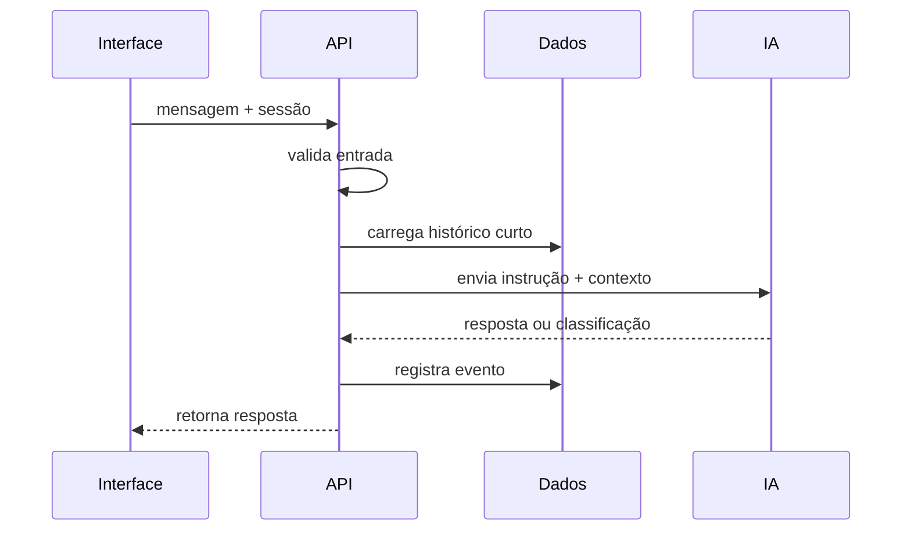

# 3. Chatbot e IA

[Anterior: Mapa das tecnologias](02-mapa-das-tecnologias.md) ·
[Início](../README.md) · [Próximo: Dados e CRM](04-dados-e-crm.md)

A integração entre chat e IA deve ser pensada como uma troca controlada: o
frontend envia a mensagem, o backend monta contexto permitido e o provedor
retorna uma resposta ou classificação.

## Fluxo recomendado



## Contexto mínimo

O erro mais comum é enviar contexto demais. A chamada para IA costuma precisar
apenas de:

- instrução do papel da IA;
- mensagem atual;
- últimas interações relevantes;
- fatos do domínio autorizados;
- formato esperado da resposta.

```ts
const request = {
  instruction: "Classifique a intenção e responda no tom definido.",
  message,
  history: recentMessages.slice(-8),
  format: "json-or-text",
};
```

## Classificação antes da resposta

Quando o sistema precisa alimentar CRM e dashboard, a resposta textual sozinha
não basta. É útil registrar uma categoria estruturada.

```ts
type Triage = {
  intent: "question" | "interest" | "support" | "other";
  confidence: number;
  tags: string[];
};
```

Essa classificação não precisa expor a lógica interna para o usuário. Ela existe
para roteamento, relatórios e acompanhamento.

## Fallback

Toda integração com IA deve prever:

- provedor indisponível;
- resposta vazia;
- formato inválido;
- confiança baixa;
- limite de custo ou requisições;
- erro de autenticação.

O fallback pode ser uma resposta neutra, encaminhamento manual ou uma pergunta
de esclarecimento. O importante é que a interface não dependa de uma resposta
perfeita do modelo.

Exemplos relacionados: [fluxo API, chat e IA](exemplos-de-integracao.md#fluxo-api-chat-e-ia) e [gateway de IA](exemplos-de-integracao.md#gateway-de-ia).

[Próximo: Dados e CRM](04-dados-e-crm.md)
