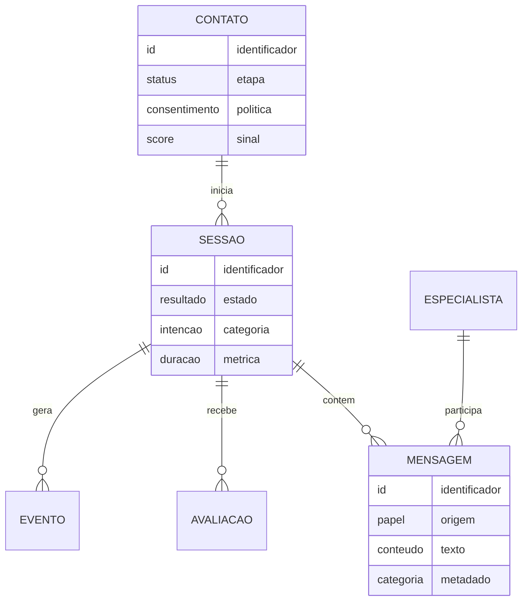
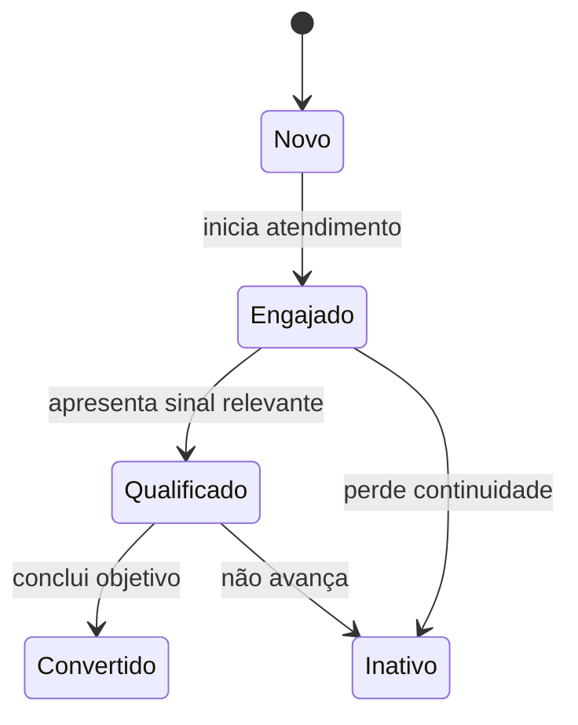

# 3. Dados e CRM

[Anterior: Arquitetura](02-arquitetura.md) · [Início](../README.md) ·
[Próximo: IA conversacional](04-ia-conversacional.md)

O CRM nasce quando a conversa deixa de ser apenas texto e passa a produzir
eventos relacionáveis, consultáveis e explicáveis.

## Modele o ciclo, não a tela

Uma base mínima costuma precisar destes conceitos:



Os nomes podem mudar, mas a separação importa:

- **contato** representa a pessoa conhecida;
- **sessão** representa um atendimento;
- **mensagem** preserva a sequência da conversa;
- **evento** registra mudanças importantes;
- **configuração** controla comportamento editável;
- **insight** guarda uma análise derivada, nunca a fonte original.

### Um schema mínimo

```ts
export const sessions = sqliteTable("sessions", {
  id: text("id").primaryKey(),
  contactId: text("contact_id")
    .notNull()
    .references(() => contacts.id),
  status: text("status").notNull().default("open"),
  primaryIntent: text("primary_intent"),
  startedAt: text("started_at").notNull(),
  endedAt: text("ended_at"),
});

export const messages = sqliteTable("messages", {
  id: text("id").primaryKey(),
  sessionId: text("session_id")
    .notNull()
    .references(() => sessions.id),
  role: text("role").notNull(),
  content: text("content").notNull(),
  intent: text("intent"),
  confidence: real("confidence"),
});
```

O vínculo `contato -> sessão -> mensagem` preserva o histórico sem misturar a
identidade da pessoa com cada atendimento. Veja o
[schema genérico completo](https://github.com/EduardoSwarowsky/guia-ia-conversacional-crm/blob/master/examples/db/schema.ts).

## Defina o dado mínimo

Para cada campo, responda:

1. Por que ele é necessário?
2. Quem pode vê-lo?
3. Por quanto tempo será mantido?
4. Ele pode ser calculado em vez de armazenado?
5. Como será corrigido ou removido?

Não colete telefone, empresa, localização ou qualquer outro dado apenas porque
“pode ser útil”. A coleta deve ter propósito e base legítima.

## Transforme mensagens em eventos

Além do texto, registre metadados que ajudem a interpretar o atendimento:

| Metadado | Utilidade |
|---|---|
| papel da mensagem | separar pessoa, assistente e sistema |
| intenção | agrupar necessidades semelhantes |
| especialidade | medir roteamento e carga |
| confiança | localizar classificações frágeis |
| marcadores | permitir filtros de domínio |
| horário | reconstruir sequência e duração |
| resultado | distinguir aberto, resolvido ou encaminhado |

Metadados produzidos por IA devem ser identificados como estimativas e poder ser
revistos.

## Use um ciclo de relacionamento simples

Comece com poucos estados. Um exemplo genérico:



Cada transição precisa de uma condição observável. Evite mudar status apenas
porque o modelo “pareceu confiante”.

## Pontuação de relacionamento

Um score pode ajudar a ordenar contatos, mas não deve esconder sua lógica.
Construa-o por categorias:

- **engajamento:** frequência e continuidade;
- **intenção:** presença de sinais relevantes;
- **completude:** dados fornecidos com consentimento;
- **resultado:** sessões resolvidas ou ações concluídas;
- **recência:** tempo desde a última interação.

Defina limites por categoria para impedir que um único comportamento domine a
pontuação. Exiba também o motivo do score. A operação precisa entender por que
um contato foi priorizado.

### Mantendo o score auditável

```ts
const engagement = Math.min(
  signals.activeSessions * 4 + signals.meaningfulInteractions * 2,
  30,
);
const intent = signals.hasRelevantIntent ? 25 : 0;
const outcome = signals.completedGoal ? 20 : 0;

return {
  engagement,
  intent,
  outcome,
  total: Math.min(engagement + intent + outcome, 100),
};
```

Retornar o detalhamento evita que o score se torne uma caixa-preta. Os pesos
acima são apenas ilustrativos; veja a
[função completa](https://github.com/EduardoSwarowsky/guia-ia-conversacional-crm/blob/master/examples/crm/lead-score.ts).

## Evite métricas inconsistentes

Escolha uma definição oficial para cada indicador:

| Indicador | Decisão necessária |
|---|---|
| conversão | qual evento confirma o objetivo |
| abandono | tempo, ausência de resposta ou encerramento explícito |
| duração | primeiro e último evento considerados |
| intenção principal | primeira, última ou mais frequente |
| resolução | automática, declarada pela pessoa ou revisada pela equipe |
| contato único | e-mail, identificador interno ou outra estratégia |

Documente essas definições perto das consultas de analytics.

## O que deve estar resolvido

Avance quando for possível reconstruir uma sessão, explicar seus metadados e
calcular as métricas sem depender do estado da interface.

[Próximo: IA conversacional](04-ia-conversacional.md)
