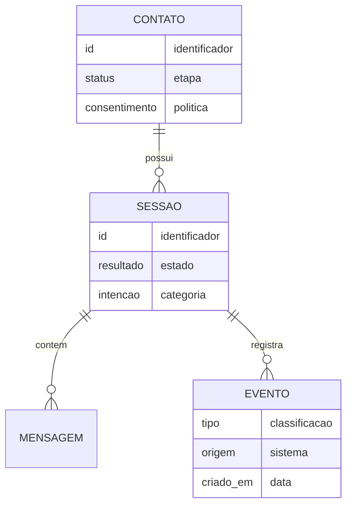

# 4. Dados e CRM

[Anterior: Chatbot e IA](/docs/03-chatbot-e-ia) · [Início](/) ·
[Próximo: Dashboard](/docs/05-dashboard-e-analytics)

O CRM surge quando os eventos da conversa são registrados de forma organizada.
O objetivo não é armazenar tudo, mas preservar o que ajuda a acompanhar uma
relação ou atendimento.

## Modelo conceitual



## Eventos úteis

| Evento | Uso |
|---|---|
| contato identificado | vincular conversas futuras |
| sessão iniciada | medir volume e jornada |
| mensagem recebida | reconstruir contexto |
| intenção classificada | alimentar CRM e dashboard |
| resposta enviada | auditar atendimento |
| sessão encerrada | calcular resultado |

## Registro mínimo

```ts
type SessionEvent = {
  sessionId: string;
  type: "message" | "triage" | "summary" | "status";
  source: "user" | "assistant" | "system";
  payload: Record<string, unknown>;
  createdAt: string;
};
```

Esse formato permite evoluir sem amarrar o banco a componentes visuais.

## CRM como leitura dos eventos

Status, tags e score devem ser derivados de sinais observáveis:

- número de sessões;
- intenção recorrente;
- consentimento para contato;
- resultado da sessão;
- recência da interação;
- avaliação ou feedback.

Evite esconder decisões importantes dentro de um score único. Quando houver
priorização, mostre também os fatores usados.

Exemplo relacionado: [evento para CRM](/docs/exemplos-de-integracao?id=evento-para-crm).

[Próximo: Dashboard](/docs/05-dashboard-e-analytics)
