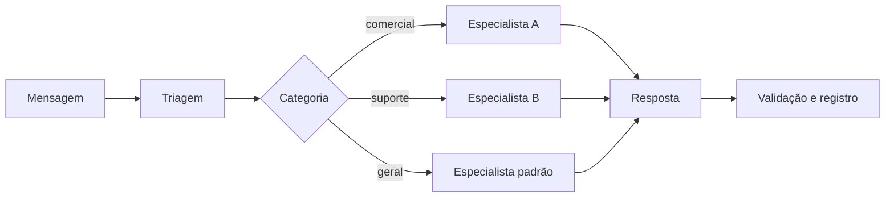

# 4. IA Conversacional

[Anterior: Dados e CRM](03-dados-e-crm.md) · [Início](../README.md) ·
[Próximo: Experiência do chat](05-experiencia-do-chat.md)

Uma camada de IA sustentável separa interpretação, resposta e política. Isso
reduz prompts gigantes e torna o comportamento observável.

## Organize o fluxo em papéis

“Especialista” não precisa ser outro modelo. Pode ser apenas um conjunto de
instruções, ferramentas e limites aplicado ao mesmo provedor.

## Contrato da triagem

A classificação deve retornar um objeto estruturado com campos equivalentes a:

| Campo | Função |
|---|---|
| categoria | necessidade principal identificada |
| destino | especialidade recomendada |
| confiança | grau de certeza da classificação |
| marcadores | contexto complementar para busca e métricas |
| justificativa curta | apoio para auditoria, quando apropriado |

Valide o resultado contra uma lista permitida. Se o formato estiver inválido,
a confiança for baixa ou o destino estiver indisponível, use um atendimento
padrão seguro.

## Contexto sem excesso

Enviar toda a conversa em cada chamada aumenta custo, latência e risco de
exposição. Monte o contexto em camadas:

1. política global e limites;
2. instruções da especialidade;
3. fatos confiáveis do domínio;
4. resumo da sessão, se necessário;
5. últimas mensagens relevantes;
6. mensagem atual.

Separe fatos do sistema de conteúdo fornecido pela pessoa. Nunca trate texto do
usuário como instrução de maior prioridade.

## Provedor substituível

Centralize diferenças entre Gemini, OpenAI ou outro serviço:

- formato de histórico;
- nome do modelo;
- limites de tokens;
- parâmetros de geração;
- resposta estruturada;
- códigos de erro;
- medição de custo e latência.

O domínio não deve importar SDKs de IA diretamente. Ele chama capacidades
abstratas e recebe uma resposta normalizada.

## Fallbacks necessários

Planeje o comportamento para:

- chave ausente ou inválida;
- limite de requisições;
- indisponibilidade do provedor;
- resposta vazia;
- objeto estruturado inválido;
- conteúdo fora de política;
- tempo de resposta excessivo.

Uma mensagem honesta e uma alternativa de contato são melhores do que inventar
uma resposta ou manter a interface carregando indefinidamente.

## Resumos e insights

Use geração secundária somente quando houver propósito claro:

- resumir uma sessão para leitura operacional;
- sugerir temas recorrentes em dados agregados;
- apontar casos que merecem revisão;
- apoiar a criação de uma base de conhecimento.

O resultado deve indicar período, fonte e momento da geração. Insights não
substituem os dados que os originaram.

## Avaliação

Crie um conjunto de mensagens representativas e avalie:

| Dimensão | Pergunta |
|---|---|
| roteamento | a categoria e o destino estão corretos? |
| utilidade | a resposta ajuda a concluir a tarefa? |
| fidelidade | a resposta evita fatos não fornecidos? |
| segurança | instruções maliciosas alteram o comportamento? |
| consistência | entradas semelhantes recebem tratamento compatível? |
| eficiência | latência e consumo estão dentro do limite? |

Teste novamente sempre que mudar modelo, instruções, categorias ou contexto.

## Critério de saída

Avance quando falhas de classificação e geração possuírem fallback, os
metadados forem validados e o provedor puder ser trocado sem alterar o domínio.

[Próximo: Experiência do chat](05-experiencia-do-chat.md)
