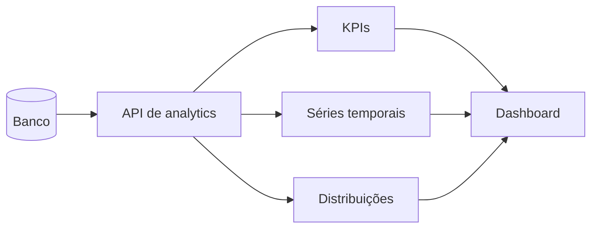

# 5. Dashboard e Analytics

[Anterior: Dados e CRM](/docs/04-dados-e-crm) · [Início](/) ·
[Próximo: Segurança](/docs/06-seguranca-e-operacao)

O dashboard é a camada de leitura operacional. Ele não precisa conhecer prompts
ou detalhes do chat; precisa receber métricas confiáveis.

## Integração correta



## Agregue no backend

```sql
SELECT
  COUNT(DISTINCT session_id) AS sessions,
  COUNT(*) AS messages,
  intent
FROM conversation_events
WHERE created_at >= :from
  AND created_at < :to
GROUP BY intent;
```

A interface recebe apenas o resultado agregado. Isso reduz tráfego, melhora
performance e limita exposição de dados pessoais.

## Métricas comuns

| Métrica | Fonte |
|---|---|
| sessões por período | eventos de sessão |
| intenções mais frequentes | triagem |
| taxa de resolução | status de encerramento |
| volume por canal | metadados de origem |
| tempo médio | início e fim da sessão |
| casos pendentes | status operacional |

## Insights com IA

A IA pode resumir tendências, mas deve trabalhar sobre dados agregados sempre
que possível. Um insight útil aponta uma hipótese e indica a métrica que a
sustenta.

```ts
type InsightInput = {
  period: string;
  metrics: Record<string, number>;
  topIntents: { intent: string; count: number }[];
};
```

O texto gerado não substitui a métrica nem a decisão humana.

Exemplos relacionados: [consulta para dashboard](/docs/exemplos-de-integracao?id=consulta-para-dashboard) e [insight com IA](/docs/exemplos-de-integracao?id=insight-com-ia).

[Próximo: Segurança](/docs/06-seguranca-e-operacao)
