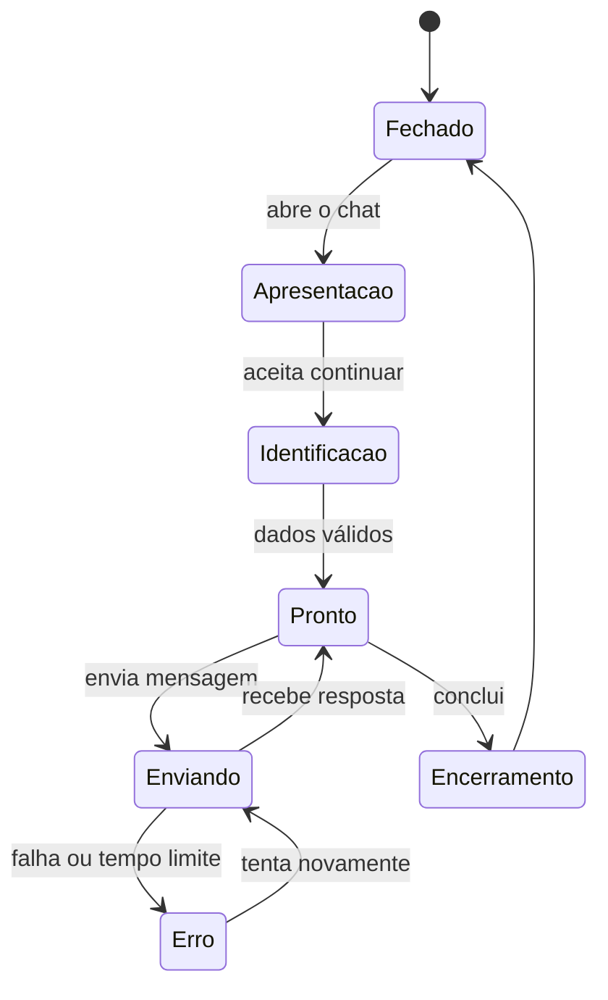

# 5. Experiência do Chat

[Anterior: IA conversacional](04-ia-conversacional.md) · [Início](../README.md) ·
[Próximo: Dashboard](06-dashboard-e-analytics.md)

A qualidade percebida depende menos do efeito visual e mais da clareza dos
estados, do ritmo da conversa e da recuperação quando algo falha.

## Desenhe a jornada completa

Defina texto, ação disponível e informação preservada em cada estado.

## Capture dados no momento certo

Existem três estratégias comuns:

| Estratégia | Vantagem | Risco |
|---|---|---|
| antes da conversa | associa todo o histórico | aumenta abandono inicial |
| depois da primeira resposta | demonstra valor antes da coleta | cria sessão anônima temporária |
| apenas quando necessário | reduz coleta | exige fluxo contextual mais complexo |

Escolha conforme o objetivo. Sempre explique por que o dado está sendo pedido e
se o contato posterior depende de consentimento.

## Use armazenamento local como cache

O navegador pode guardar:

- identificador opaco do contato;
- identificador da sessão atual;
- preferência de abertura;
- pequeno histórico para restauração visual.

Ele não deve guardar:

- chaves de API;
- credenciais administrativas;
- regras internas;
- dados sensíveis desnecessários;
- o único registro existente da conversa.

Ao retornar, confirme a sessão no servidor antes de confiar no estado local.

## Estados essenciais

### Carregamento

Mostre que a mensagem foi recebida e impeça envios duplicados. Defina um tempo
limite e permita cancelamento ou nova tentativa.

### Erro

Preserve o texto digitado, explique o que a pessoa pode fazer e não exponha
detalhes internos do provedor.

### Offline

Apresente um canal alternativo ou informe quando tentar novamente.

### Retorno

Restaure apenas o contexto válido. Dê uma forma clara de trocar identidade,
iniciar nova sessão ou apagar o cache local.

### Encerramento

Confirme o resultado, ofereça avaliação opcional e explique próximos passos.

## Responsividade e acessibilidade

- Use painel compacto em telas grandes e experiência de tela inteira no mobile.
- Mantenha o campo de mensagem visível quando o teclado virtual abrir.
- Garanta navegação por teclado e foco previsível.
- Associe rótulos a campos e anuncie novos estados para leitores de tela.
- Não dependa somente de cor para diferenciar pessoa, sistema e status.
- Respeite redução de movimento.
- Teste textos longos, zoom e conexão lenta.

## Não revele o roteamento interno

A pessoa deve perceber continuidade, mesmo que o sistema altere a
especialidade. Mostre uma transferência apenas quando isso ajudar a definir
expectativa, responsabilidade ou tempo de resposta.

## Critério de saída

Avance quando o fluxo funcionar em mobile e desktop, suportar retorno, erro e
timeout, e deixar claro quais dados são coletados e por quê.

[Próximo: Dashboard](06-dashboard-e-analytics.md)
