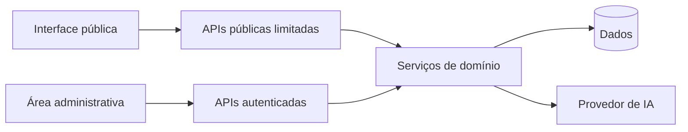

# 7. Segurança e Privacidade

[Anterior: Dashboard](06-dashboard-e-analytics.md) · [Início](../README.md) ·
[Próximo: Roteiro](08-roteiro-de-implementacao.md)

Aplicações conversacionais combinam dados pessoais, conteúdo livre e serviços
externos. Segurança precisa estar no desenho inicial.

## Separe superfícies públicas e administrativas

Rotas públicas devem permitir somente o necessário para iniciar e continuar uma
sessão. Listagens, configurações, analytics e históricos completos pertencem à
área autenticada.

Não confie apenas em esconder links administrativos. A autorização deve ocorrer
no servidor em toda requisição protegida.

## Proteja segredos

- Mantenha chaves de IA somente no servidor.
- Use variáveis de ambiente ou um cofre de segredos.
- Se houver configuração persistida, use criptografia apropriada e rotação.
- Nunca devolva o valor completo à interface administrativa.
- Não registre segredos em logs.
- Separe credenciais por ambiente.

Uma máscara visual não protege um valor que já foi enviado ao navegador.

## Valide toda entrada

Para mensagens e formulários:

- valide tipo, formato e tamanho;
- normalize espaços e campos opcionais;
- limite frequência por origem e por sessão;
- rejeite identificadores que não pertencem ao contexto autorizado;
- use consultas parametrizadas;
- trate uploads e links como conteúdo não confiável.

Evite registrar o corpo completo de uma requisição por padrão.

## Considere ameaças específicas de IA

| Ameaça | Controle |
|---|---|
| injeção de prompt | separar instruções, dados e ferramentas |
| saída fora do formato | validação por esquema e fallback |
| vazamento de contexto | enviar apenas dados necessários |
| abuso de custo | limites, cotas e monitoramento |
| alucinação | base confiável, linguagem de incerteza e revisão |
| ação indevida | confirmação e autorização determinística |

O modelo nunca deve decidir se uma pessoa tem permissão para acessar um recurso.

## Privacidade e retenção

Defina:

- finalidade de cada dado;
- base legal aplicável;
- consentimento para contato;
- prazo de retenção;
- processo de correção e exclusão;
- quem pode consultar conversas;
- quais dados são enviados ao provedor;
- como incidentes serão tratados.

No Brasil, avalie a aplicação da LGPD com apoio jurídico adequado. Este guia não
substitui análise legal.

## Publicação segura

Antes de tornar um repositório público, procure por:

- arquivos de ambiente;
- bancos locais e backups;
- tokens, senhas e chaves;
- dados de contato e conversas;
- prompts internos completos;
- URLs privadas;
- logs e capturas de tela;
- histórico Git com conteúdo removido apenas no último commit.

Apagar um arquivo no commit atual não o remove do histórico. Se houve vazamento,
revogue o segredo primeiro e trate o histórico como uma operação separada.

## Critério de saída

Avance quando rotas administrativas exigirem autorização real, segredos nunca
chegarem ao cliente, entradas tiverem limites e a política de dados estiver
documentada.

[Próximo: Roteiro](08-roteiro-de-implementacao.md)
