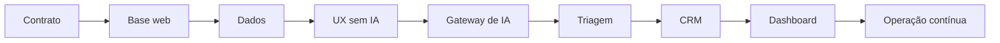

# 8. Roteiro de Implementação

[Anterior: Segurança](07-seguranca-e-privacidade.md) · [Início](../README.md) ·
[Próximo: Validação](09-checklist-de-validacao.md)

Implemente em fatias que entreguem um fluxo verificável. Não comece pelo
dashboard completo nem pelo sistema de múltiplas especialidades.

## Fase 0: contrato do produto

Defina público, necessidade, resultado, dados mínimos, riscos e três a cinco
intenções iniciais.

**Saída:** uma jornada desenhada do início ao encerramento.

## Fase 1: base da aplicação

Crie a aplicação web, o padrão visual, a camada de APIs e a configuração por
ambiente. Garanta que código executado no navegador esteja separado de código
exclusivo do servidor.

**Saída:** interface e backend se comunicam por um endpoint de teste sem acessar
segredos no cliente.

## Fase 2: persistência mínima

Modele contato, sessão e mensagem. Crie migrações e uma forma de inspecionar os
dados durante o desenvolvimento.

**Saída:** uma sessão pode ser criada, receber mensagens e ser reconstruída na
ordem correta.

## Fase 3: experiência sem IA

Implemente abertura, identificação, envio, carregamento, erro, retorno e
encerramento usando respostas controladas.

**Saída:** toda a jornada funciona em mobile e desktop mesmo sem provedor de IA.

## Fase 4: gateway de IA

Adicione uma única fronteira para o provedor. Configure timeout, limites,
normalização de erros e observabilidade básica.

**Saída:** o provedor pode ser substituído sem alterar a interface ou as regras
de persistência.

## Fase 5: classificação e especialidades

Defina categorias, contrato estruturado, fallback e instruções por
especialidade. Comece com poucas categorias bem testadas.

**Saída:** o sistema registra categoria, destino e confiança para cada
interação relevante.

## Fase 6: CRM

Adicione status, marcadores e score explicável. Atualize o relacionamento a
partir de eventos observáveis, não de impressão subjetiva.

**Saída:** a equipe consegue localizar contatos, entender prioridade e revisar o
histórico.

## Fase 7: dashboard

Implemente primeiro uma visão geral, uma lista de contatos e uma lista de
conversas. Depois acrescente tendências, funil e análises.

**Saída:** cada indicador possui definição, período e consulta centralizada.

## Fase 8: segurança e operação

Endureça autenticação, autorização, rate limiting, auditoria, retenção, backups e
monitoramento de custo e erro.

**Saída:** checklist de segurança aprovado e procedimento de incidente
documentado.

## Fase 9: avaliação contínua

Monte uma coleção de conversas de teste, acompanhe erros de roteamento e revise
instruções com controle de versão.

**Saída:** mudanças de modelo ou comportamento passam por comparação antes de
serem publicadas.

## Ordem das dependências

## Regra para avançar

Não avance porque a tela “parece pronta”. Avance quando o critério de saída da
fase puder ser demonstrado e testado.

[Próximo: Validação](09-checklist-de-validacao.md)
